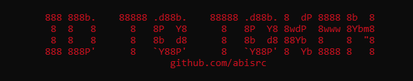

    
    
     
     
    
     
    
    

## 📷 Preview

## ❌ Errors?
- Make an [issue](https://github.com/abisrc/ID-To-Token/issues)
- Join the [Discord](https://discord.gg/GtABQ4PyjQ)

Made with :heart: and Python!
